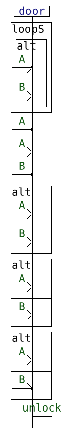
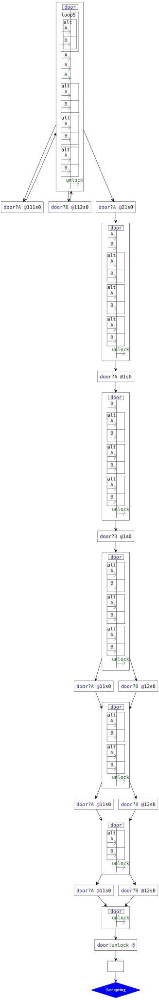
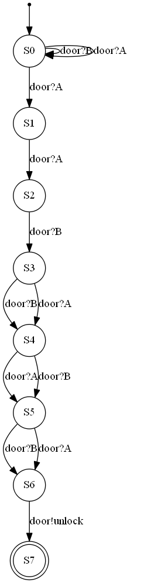
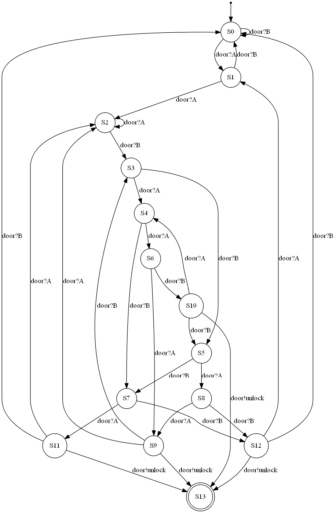
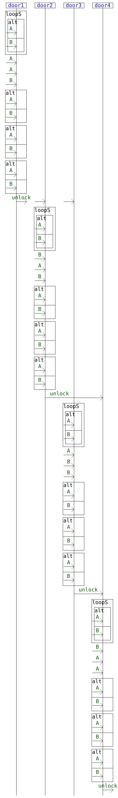
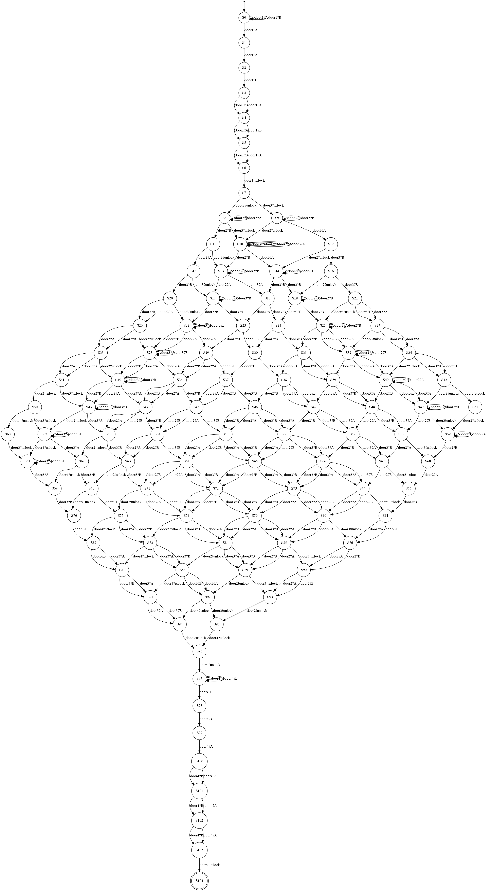
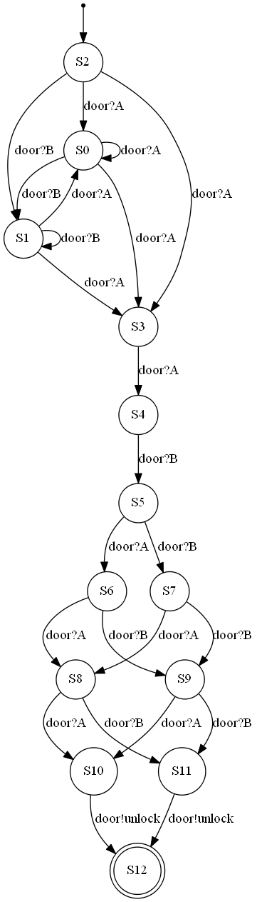
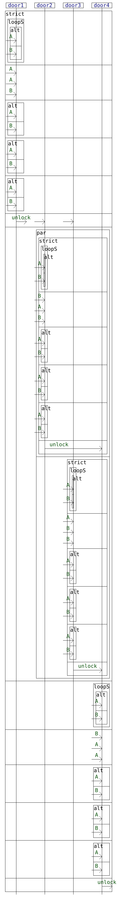
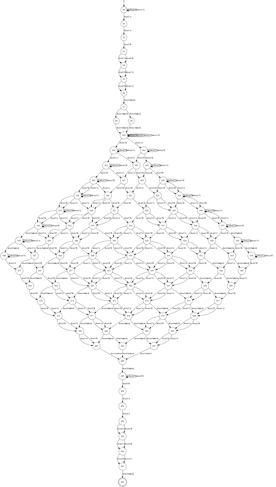

# A small experiment on the generation of NFA from interaction diagrams using HIBOU


Interactions encode as binary tree terms behavioral models similar to Message Sequence Charts and UML Sequence Diagrams.
They are associated with a trace semantics which can be defined equivalently in operational and denotational style
( see [this paper](https://link.springer.com/chapter/10.1007/978-3-031-10363-6_8)).

[HIBOU](https://github.com/erwanM974/hibou_efm) implements various features to manipulate interactions.
One such feature concerns interaction execution i.e., given an initial interaction *i*
computing a follow-up term *i'* resulting from the execution of action *a* in *i*.
This execution can be complemented with on-the-fly term simplification so that term *i'* is kept simple.

We have formalized and implemented a technique for generating NFA with a reduced number of states
from Interactions. 
For a clearly identified subset of interactions (i.e. a subset of the language, without using some operators), 
these NFA accept the same language as the input Interaction.


In this repository we present some experiments on NFA generation and asses the number of states of
the generated NFA. 


## Generation quality w.r.t. minimal NFA and DFA sizes

In the following we compare the number of states of the generated NFA to:
- the number of states of the corresponding minimal NFA (using the Kameda-Weiner algorithm).
   Let us keep in mind that NFA-minimization being PSPACE-complete, this can only be done for relatively small NFA.
- the number of states of the corresponding minimal DFA (using Brzozowski's algorithm).

We also compare execution times for the generation process and the various minimization processes.

### Example usecase with locked doors

A known example for showing that an equivalent minimal DFA may have exponentially more state that the associated
minimal NFA is the following:
- given the alphabet `{a,b}`, the regular expression `(a|b)^*.a.(a|b)^n` can be encoded as a NFA with `n+2` states
while the associated minimal DFA has `2^(n+1)` states. 
This is due to the fact that this construction must keep track of the last `n` states.

Taking inspiration from this let us consider the following toy usecase.
We consider a door which is initially closed.
It can be opened by entering a combination of `A` and `B`s of the form `A.A.B.#.#.#` i.e. the code is `AAB` followed by any three characters.
In order to open the door we may therefore enter any word of the regular language `(A|B)^*.A.A.B.(A|B)^3`.

In order to encode this specification as an interaction,
we consider the door to be a lifeline called `door`
which can receive `A`s and `B`s messages as inputs
and, once it is unlocked, it emits message `unlock`.

The specification then becomes the interaction drawn below:




Using interaction execution with term simplification to explore its semantic with memoization of previously encountered terms
we get the graph structure on the left of the table below.
This graph can then be trivially transformed into the NFA in the middle below.
This NFA turns out to be the minimal NFA which can express this language.
As expected, if we determinize it and then minimize the resulting DFA we get a FA with more states 
(here 14 states instead of 8). This DFA is given on the right column below.

| Exploration                                  | NFA                                                  | min DFA                                              |
|----------------------------------------------|------------------------------------------------------|------------------------------------------------------|
|  |  |  |


As a distributed/concurrent system, this usecase can be described in the top left cell of the table below.
With a single door having inputs and outputs.
More complex structure of linked doors can be formed, with the unlocking of a door allowing another one to be opened and so on.
The second row of the table gives an example with 4 doors. Opening the first one allows trying to enter the codes for the 2 following doors.
Then, we need to open those two next doors to start trying to open the final door.
The third row gives a more complex example.
The third column of the table below provides the behavioral specification of the system thus constructed
in the form of an interaction diagram.

| Example      | structure                                    | diagram                                          | NFA                                                  |
|--------------|----------------------------------------------|--------------------------------------------------|------------------------------------------------------|
| with 1 door  |  |  |  |
| with 4 doors |  |        |        |
| with 8 doors |   | SEE folder README_images                         | TOO BIG                                              |


### Results 

The following table summarizes the results for our examples with 1, 4 and 8 doors.
In the column titles of the table below :
- #Q refers to a number of states
- KW refers to the Kameda-Weiner algorithm
- B refers to Brzozowski's algorithm

| Example      | #Q original NFA | time gen            | #Q min NFA | time KW     | #Q min DFA | time det min B      |
|--------------|-----------------|---------------------|------------|-------------|------------|---------------------|
| with 1 door  | 8               | ~230 micro seconds  | 8          | ~30 seconds | 14         | ~130 micro seconds  |
| with 4 doors | 105             | ~7400 micro seconds | ?          | TIMEOUT     | 312        | ~8000 micro seconds |
| with 8 doors | 2881            | ~1 seconds          | ?          | TIMEOUT     | 16274      | ~2 seconds          |


## Comparison with compositional approach

Our approach for computing NFA from Interaction relies on the exploration of the Interaction's execution tree.

A classical approach from the literature
(see [Model Checking of Message Sequence Charts](https://link.springer.com/chapter/10.1007/3-540-48320-9_10)
for graphs of basic Message Sequence Charts
and [Runtime Monitoring of Web Service Conversations](https://ieeexplore.ieee.org/document/5156490)
for UML Sequence Diagrams)
deals with this translation problem differently.

This approach relies on identifying basic building blocks of specifications as basic Message Sequence Charts
or basic SD which only contains basic message passing primitives and weak sequencing.
For each such basic blocks, a NFA is inferred.
Then, the global NFA is inferred by compositions of those smaller NFA:
- for bMSC-graphs by interpreting edges of the graph as a concatenation operator for NFA (hence strict sequencing)
- for UML-SD by matching UML-SD operators to operators on NFA e.g. NFA union for *alt*, NFA Kleene for *loop* etc.

The main problem with this method is that of expressivity.
- for [Model Checking of Message Sequence Charts](https://link.springer.com/chapter/10.1007/3-540-48320-9_10), 
with graphs of bMSC, graph edges can only be interpreted as strict sequencing (otherwise the problem becomes non-decidable).
Our approach is more flexible as it equates to choosing to interpret some edges as strict sequencing and some other as weak sequencing.
- for [Runtime Monitoring of Web Service Conversations](https://ieeexplore.ieee.org/document/5156490),
with UML-SD, given that there is no NFA operator equivalent to weak sequencing, the use of weak sequencing
is constrained within basic SD blocks. Hence weak sequencing cannot be used to structure more complex behavior (i.e. we can't nest complex operators such as *loop*, *par*, *alt* underneath a *seq*)


As a first element of comparison between both methods, below is represented how each
generated NFA looks for the example with a single door.

| NFA via interaction exploration (our method)         | NFA via cutting into basic SDs and composition                |
|------------------------------------------------------|---------------------------------------------------------------|
|  |  |


In order to be able to use this compositional method for our example with 4 doors, 
we need to replace occurrences of *seq* 
(at positions in which the sub-interaction contains operators other than *strict* and *seq* )
by either *strict* or *par* 
(depending on the behavior we want to retain).

This yields the following interaction:



This then enables us to compare our method w.r.t. this compositional method in the table below.


| Example                     | #Q our NFA | time gen            | #Q compositional NFA | time gen            | #Q min DFA | time min DFA after compo | 
|-----------------------------|------------|---------------------|----------------------|---------------------|------------|--------------------------|
| with 1 door                 | 8          | ~230 micro seconds  | 13                   | ~370 micro seconds  | 14         | ~120 micro seconds       |
| with 4 doors strict and par | 97         | ~3500 micro seconds | 223                  | ~7300 micro seconds | 298        | ~8100 micro seconds      |


Drawing the NFA generated using both methods for the example with 4 doors with strict and par yields the following :

| NFA via interaction exploration (our method)       | NFA via cutting into basic SDs and composition      |
|----------------------------------------------------|-----------------------------------------------------|
|  |  |


## Running the experiments

With the HIBOU tool executable in the repository you can use the following command:

```
./hibou_label.exe nfa_experiment models/secret_code.hsf models/secret_code.hif -n 100 -k 5
```

Or more generally

```
./hibou_label.exe nfa_experiment models/x.hsf models/x.hif -n y -k z
```

Where:
- `x` is the name of the model to consider
- `y` is the number of tries. For each try a computation is made (translation, minimization, etc) and the time required to perform it is stored.
The median value of those tries times is used as the return value for the required time.
- `z` is an arbitrary limit on states number to give up using Kameda Weiner for NFA minimization (In practice Kameda Weiner is not really usable for NFA which minimized version has more than 15-20 states)

